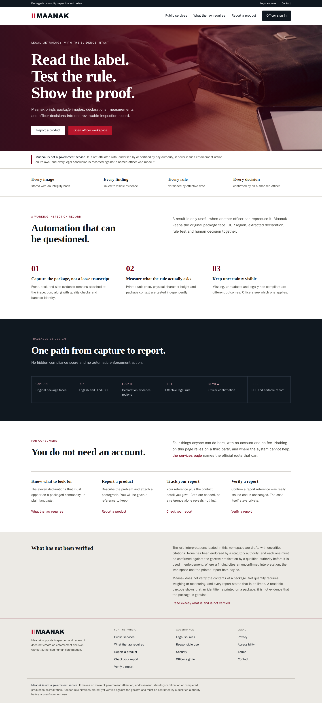
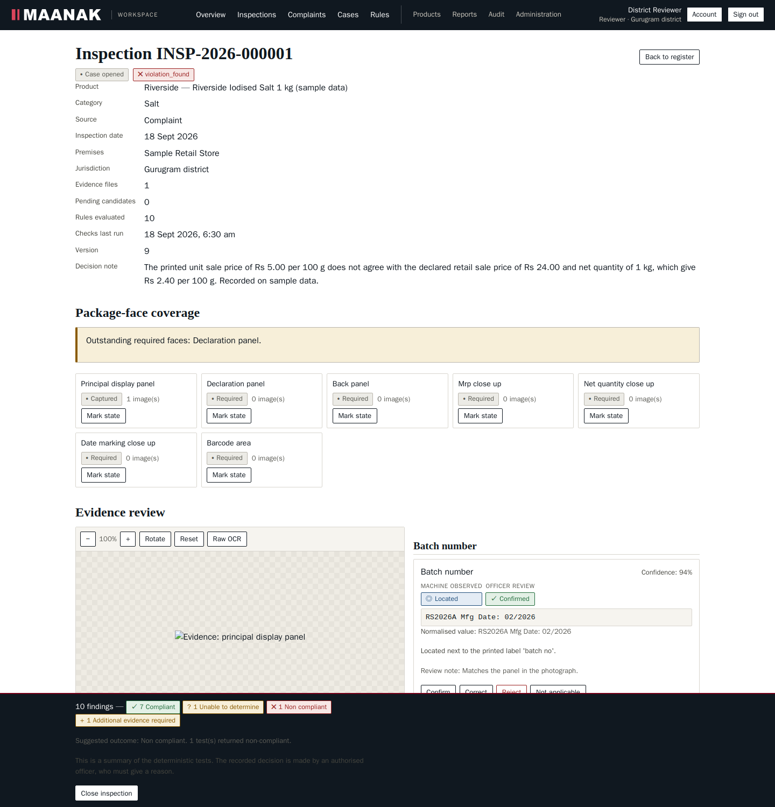
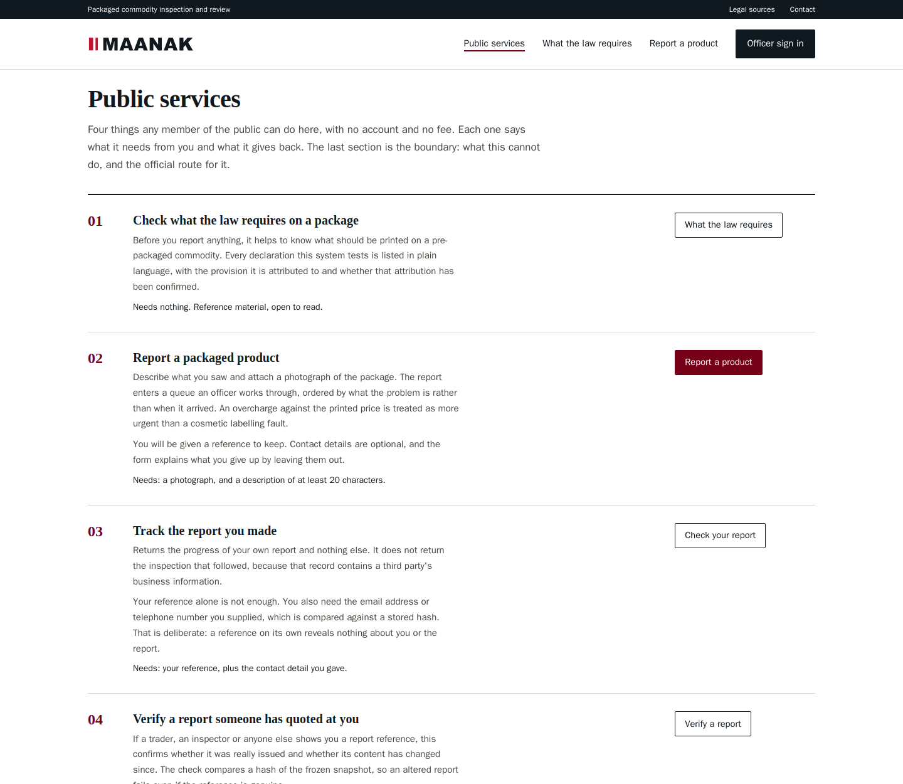
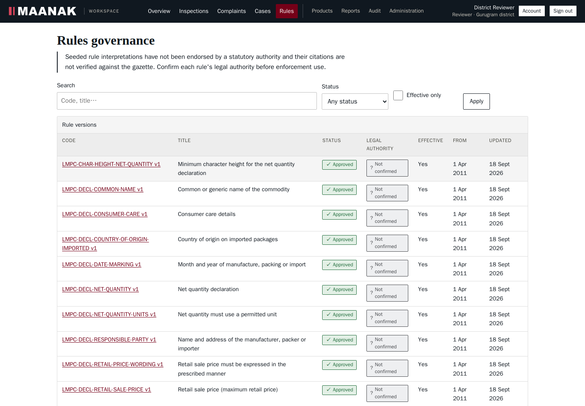

# Maanak

Evidence-led inspection recording for packaged commodities in India.

An officer photographs a package. Maanak reads the label, keeps the image beside what
was read from it, applies a versioned rule interpretation to the values the officer has
reviewed, and produces a report anyone can verify later without being shown the case.

**Maanak is not a government service.** It is not affiliated with, endorsed by or
certified by any authority, and it issues no enforcement action of its own. Every legal
conclusion is recorded against the named officer who reached it.



---

## The two rules the code actually enforces

Most of the design follows from these. They are not aspirations in a document; they are
enforced in the check implementations and covered by tests.

**Absent evidence is never a violation.** Three situations look alike on screen and mean
entirely different things: the package genuinely lacks a declaration, the photograph
does not show the panel, or the panel is visible but unreadable. Only the first is a
compliance failure. The second returns *additional evidence required*, the third
*unable to determine*, and no configuration makes either report as non-compliant.

You can watch the difference. Running the checks on an inspection **before** officer
review produces 7 *additional evidence required*, 3 *unable to determine* and **zero**
non-compliant. After review of the same photograph, 10 rules apply and one non-compliant
finding appears. The evidence did not change. The review did.

**Machine observation and officer decision are separate records.** OCR writes a
*candidate* with a machine state and a confidence. An officer separately writes a review
state. A correction never overwrites what the machine read: the previous state is written
to a revision first, and both appear in the report. Only reviewed values reach the rule
engine, and that is enforced in the engine rather than left to the interface.

---

## What happens to a package

1. Each image is validated from its own bytes and measured on eleven quality signals —
   sharpness, glare, highlight and shadow clipping, brightness, contrast, resolution,
   skew, framing, text size and capture source — then the officer is told what to fix in
   plain words: "strong glare is covering part of the panel".
2. The original bytes are stored unchanged, hashed with SHA-256, and the chain of custody
   is recorded. Location is never read from photograph metadata.
3. A background worker reads the panel with Tesseract in English and Hindi, trying
   several language and orientation configurations and keeping whichever measurably reads
   best.
4. Declarations are located and normalised with exact `Decimal` arithmetic and unit-aware
   conversion: MRP, net quantity, unit sale price, manufacturer, consumer care, country of
   origin, date marking, batch.
5. Each reading is shown beside the region of the image it came from, to confirm, correct
   or reject with a reason.
6. Approved rule versions are applied to the reviewed values, and every finding records
   its citation, why that version was selected, the inputs and the arithmetic.
7. A report snapshot is frozen, hashed, and rendered to PDF and to an editable document
   from that snapshot.
8. A public page confirms a report exists and is unchanged, without disclosing the case.



Consumers need no account. A complaint can be triaged into an inspection, carrying the
consumer's photograph across as evidence. A reported inspection can become a case with a
served, frozen notice.

### What the public can do without an account

Four services, exposed on the homepage and gathered under
[web/services.html](web/services.html):

| Service | Needs | Returns |
| --- | --- | --- |
| Read what must be printed on a package | nothing | The eleven declarations in plain language, each with the provision it is attributed to and whether that attribution is confirmed |
| Report a packaged product | a photograph and a description | A reference to keep. Contact details are optional |
| Track that report | the reference **and** the contact detail given | Progress only, never the inspection that followed |
| Verify a report reference | the reference and its printed code | Whether the report was issued and is unchanged, disclosing nothing about the case |



The services page also states the boundary, which matters more than appearing complete.
**Nothing here assesses nutrition, ingredients, allergens or food safety.** No rule in
this system derives from the Food Safety and Standards regulations, and it gives no
dietary advice. Net quantity cannot be confirmed from a photograph, and a readable
barcode is not evidence that a product is genuine. For each of those the page names the
authority that does hold the power: FSSAI, the state Controller of Legal Metrology, the
National Consumer Helpline on 1915, and electronic filing before a consumer commission.

---

## Character height, and why it refuses to guess

A minimum character height in millimetres cannot be derived from a photograph. The same
letter fills more pixels from closer and fewer from further away, and without a known
scale in frame there is no conversion.

So the check refuses. Without an officer's measurement it returns *additional evidence
required* and says what is needed. With a measurement it compares against the threshold
**together with the stated uncertainty**, and a measurement whose band crosses the
threshold returns *unable to determine* rather than a decision that would not survive
being challenged.

This is the clearest case of a general rule: the system would rather say it does not know.

---

## Run it

Docker with Compose v2 is the only requirement. No Python, Node or database on the host.

```bash
cp .env.example .env
```

Replace every `CHANGE-ME` value in `.env`. Generate them with:

```bash
python -c "import secrets; print(secrets.token_urlsafe(48))"
python -c "import base64,os; print(base64.b64encode(os.urandom(32)).decode())"   # MINIO_KMS_SECRET_KEY
```

Then:

```bash
docker compose up --build -d
```

| What | Where |
| --- | --- |
| Browser application | http://localhost:8080 |
| API readiness | http://localhost:8000/health/ready |
| API documentation | http://localhost:8000/docs |
| Object storage console | http://localhost:9001 |

`GET /health/ready` reports each dependency separately and returns 503 while any of the
four is unavailable.

### A workspace you can explore straight away

Two commands. The first creates an account per role, loads the starter rules, and takes
each one through simulation and approval using the *second* rule administrator, because
an author cannot approve their own version. The second walks one case through the entire
path so the workspace is not empty.

```bash
docker compose run --rm --no-deps -e API_URL=http://api:8000 \
  --entrypoint python api scripts/seed_demo.py

docker compose run --rm --no-deps -e API_URL=http://api:8000 \
  --entrypoint python api scripts/seed_example.py
```

The second prints its progress: complaint `CMP-2026-000001` → inspection
`INSP-2026-000001` → 11 readings confirmed → checks → decision → report
`RPT-2026-000001` → case `CASE-2026-000001` → notice `NOT-2026-000001` served.

Sign in at http://localhost:8080/login.html. Every account uses the password the seeder
prints.

| Account | Role | Sees |
| --- | --- | --- |
| `inspector@example.org` | inspector | Gurugram district; captures and reviews evidence |
| `reviewer@example.org` | reviewer | Records the decision, issues reports |
| `controller@example.org` | controller | Haryana and below; cases and the audit trail |
| `ruleauthor@example.org` | rule_admin | Authors rule versions |
| `ruleapprover@example.org` | rule_admin | Approves them, which the author cannot |
| `admin@example.org` | admin | Accounts, roles, jurisdictions |
| `otherstate@example.org` | inspector | Punjab; exists to show jurisdiction isolation |

Those are throwaway local credentials. A real deployment creates the first administrator
through `POST /api/v1/auth/bootstrap`, which works once and only while no account exists.
There is no public registration.

---

## The rule interpretations are not verified, and the system says so



Eleven interpretations ship with the software. **None has been checked against a gazette
notification.** Each carries a legal-authority flag set to false, and that flag appears on
the rule, on every finding that uses it, and printed on every report.

Some values are explicit placeholders. The minimum character height is a single figure
where the real minimum varies with the area of the principal display panel. The permitted
unit lists come from ordinary retail practice rather than the Second Schedule.

[docs/LEGAL_SOURCES.md](docs/LEGAL_SOURCES.md) and the site's own
[legal sources page](web/legal-sources.html) name every one of them and the procedure to
close each gap. Read them before drawing any conclusion about what has been proven.

The engine and the citations are separate claims. What the engine does is tested and
holds regardless of whether a citation string is correct.

---

## Verify it yourself

Every suite prints each check with the value it measured, so a passing run is a readable
statement of what was verified rather than a count.

```bash
# Formatting, lint and types
docker compose run --rm --no-deps --entrypoint sh api scripts/quality.sh

# Unit tests plus the live-stack suites
docker compose run --rm --no-deps --entrypoint sh api scripts/run_tests.sh

# Browser, accessibility, links, prose
docker build -f api/Dockerfile.browser -t maanak-browser:dev api
docker run --rm --network maanak_default -v "$PWD/api:/w" -w /w \
  -e BASE_URL=http://web:8080 maanak-browser:dev
docker run --rm --network maanak_default -v "$PWD/api:/w" -w /w \
  -e BASE_URL=http://web:8080 maanak-browser:dev python scripts/audit_app.py
```

Measured on the current tree:

| Suite | Result |
| --- | --- |
| `verify_schema.py` | 14 checks — 30 tables, 184 indexes, 29 CHECK constraints, audit table rejects UPDATE and DELETE |
| `verify_security.py` | 51 checks |
| `verify_extraction.py` | 62 checks |
| `verify_rules.py` | 71 checks |
| `verify_auth_flow.py` | 53 checks |
| `verify_pipeline.py` | 56 checks |
| `verify_workflow.py` | 117 checks |
| `verify_matters.py` | 86 checks |
| `verify_browser.py` | 59 checks, 0 axe violations on 8 pages |
| `audit_app.py` | 100 checks — every page, every detail screen, 0 axe violations |
| `measure_a11y.py` | 0 axe violations across 12 public pages at WCAG 2.0/2.1/2.2 A and AA; 0 targets under 24×24 |
| `check_links.py` | 0 broken links, 72 in-page anchors resolve |
| `check_prose.py` | 0 machine-writing tells across 26 pages |
| pytest | 94 items |
| `quality.sh` | 112 files formatted, lint clean, mypy clean on 83 files |

Two of those exist because the standard tooling does not cover them. `measure_a11y.py`
measures WCAG 2.2 success criterion 2.5.8, for which axe-core has no rule, and enumerates
sticky positioning for 2.4.11. `check_prose.py` enforces the writing rules this project
holds itself to, so "the copy is not machine-generated filler" is a check and not a claim.

Both found real defects. Target-size measurement caught utility links at 19 pixels,
checkboxes at 13×13 and file inputs at 21. Extending axe to the inspection screen caught a
critical and a serious violation that had gone unnoticed on the most important screen in
the application.

---

## How it is built

A modular monolith. FastAPI serves the API; a separate arq worker runs OCR so no request
ever waits on it; Redis carries the queue; MinIO provides S3-compatible storage with
encryption at rest; PostgreSQL 16 is the only database; nginx serves the browser
application and proxies the API.

The frontend is plain HTML, CSS and ES modules. **No build step, no framework, no
bundler, no third-party script.** The content security policy is `default-src 'self'` with
no `unsafe-inline`, which is checkable rather than aspirational: an inline `style`
attribute in the officer workspace was found and removed precisely because the policy
refuses it.

Layers run in one direction. `app/api/v1/` holds routes and no logic, `app/schemas/`
validates, `app/services/` holds all behaviour, `app/models/` holds tables. `app/domain/`
holds the enums and state machines, and is the single source of truth: it generates the
database CHECK constraints *and* the vocabulary the frontend renders, so the two cannot
drift apart.

Some invariants worth knowing:

- Jurisdiction is applied inside the SQL query, never filtered from results afterwards. A
  request for a record outside your jurisdiction returns **404, not 403**, because a 403
  would confirm the record exists.
- `audit_events` rejects `UPDATE` and `DELETE` through a database trigger, so an
  administrator with full application access still cannot edit history. Entries are
  hash-chained. Forging one has been tested: verification named the offending sequence
  number and reported that its previous hash did not match.
- Money and quantities are `Decimal` throughout, rounded half-up to the paise. Never float.
- Report snapshots, served notices and evidence identity are immutable by trigger.
- Authentication is cookie-only. There are no bearer tokens anywhere in the design.
- Every request schema sets `extra="forbid"`, so a request cannot set a field the endpoint
  did not intend to expose.

[docs/ARCHITECTURE.md](docs/ARCHITECTURE.md) explains the reasoning behind each choice.

---

## Documentation

| Document | Contents |
| --- | --- |
| [ARCHITECTURE.md](docs/ARCHITECTURE.md) | Components, data flow, why each technology |
| [DEPLOYMENT.md](docs/DEPLOYMENT.md) | Clean install, environment, operations, troubleshooting |
| [LEGAL_SOURCES.md](docs/LEGAL_SOURCES.md) | What is verified, what is not, and how to close the gap |
| [PERMISSIONS.md](docs/PERMISSIONS.md) | Role and permission matrix, jurisdiction model |
| [STATE_MACHINES.md](docs/STATE_MACHINES.md) | Inspection, complaint and case states |
| [EVIDENCE.md](docs/EVIDENCE.md) | Chain of custody and report verification |
| [THREAT_MODEL.md](docs/THREAT_MODEL.md) | Threats, controls, residual risk |
| [DATA_INVENTORY.md](docs/DATA_INVENTORY.md) | Personal data, purpose, retention |
| [TESTING.md](docs/TESTING.md) | How to run every check and what each proves |
| [BACKUP_RESTORE.md](docs/BACKUP_RESTORE.md) | Backup, restore, integrity re-verification |
| [DEMO.md](docs/DEMO.md) | The connected walkthrough, in order |
| [KNOWN_LIMITS.md](docs/KNOWN_LIMITS.md) | What this does not do, and what is unproven |

---

## What this is not

This is a working local deployment, not an accredited production system. The gaps are
named individually rather than gestured at, here and on the site's own
[security](web/security.html) and [accessibility](web/accessibility.html) pages.

Absent: TLS, multi-factor authentication, malware scanning on upload, managed secrets,
monitoring, alerting, backups, an incident process, load testing, and any independent
security or accessibility assessment. No screen reader has been run against the interface.
Panning the evidence viewer needs a pointer drag, which fails WCAG 2.2 success criterion
2.5.7. Nine of the fourteen workspace screens have not been measured for accessibility.

Before field use, an authority must have every legal interpretation confirmed against the
gazette and recorded against the rule version; terminate TLS and set `COOKIE_SECURE=true`,
`DOCS_ENABLED=false` and explicit `TRUSTED_HOSTS`; move secrets into a managed store; add
MFA or SSO; replace the development report signer with a real signing service or leave
signing off rather than implying a signature exists; and commission independent security,
accessibility, legal and user-acceptance testing.

Setting `MAANAK_ENV=production` refuses to start while several of those remain unsafe. It
checks what is technically checkable and cannot check the rest.

---

## Licence

Apache License 2.0. See [LICENSE](LICENSE) and [NOTICE](NOTICE).

axe-core is vendored under `api/scripts/` for the accessibility suite, unmodified, under
the Mozilla Public License 2.0. It is not served to users and is not part of the deployed
application.
